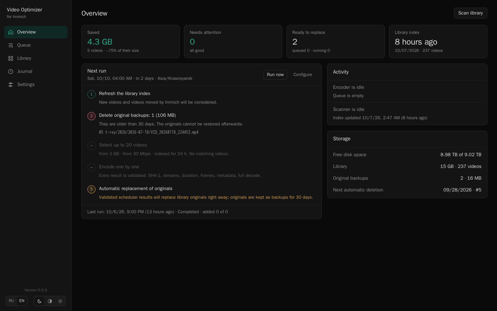
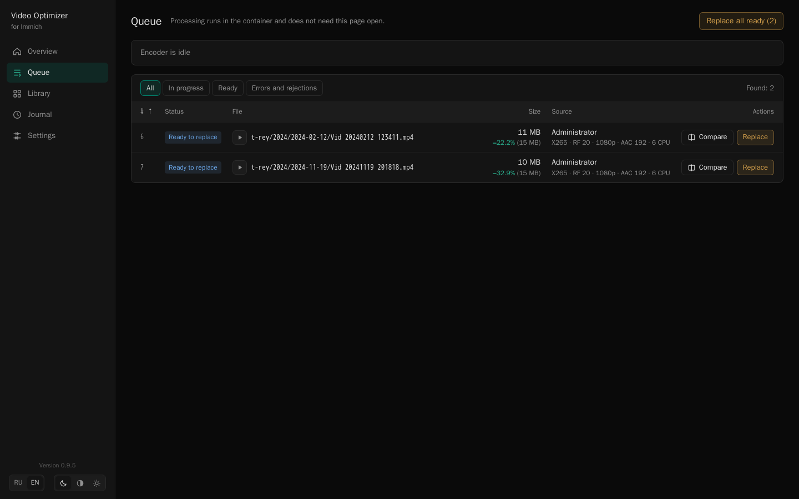
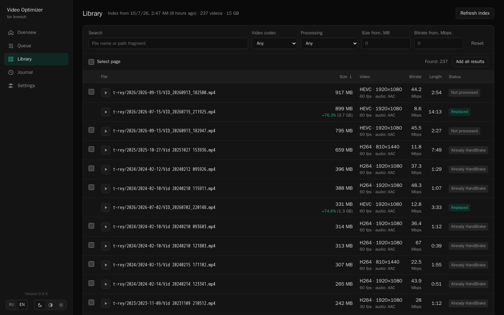
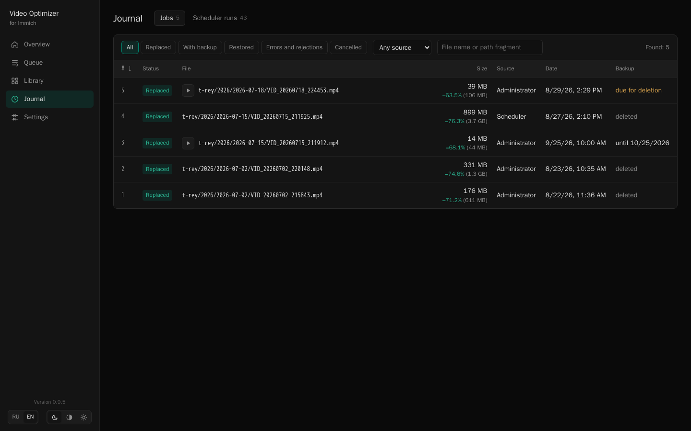
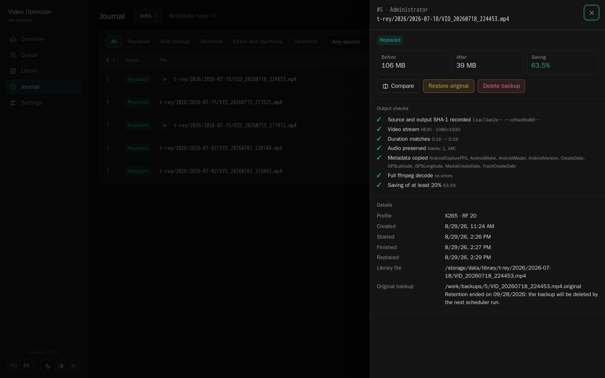
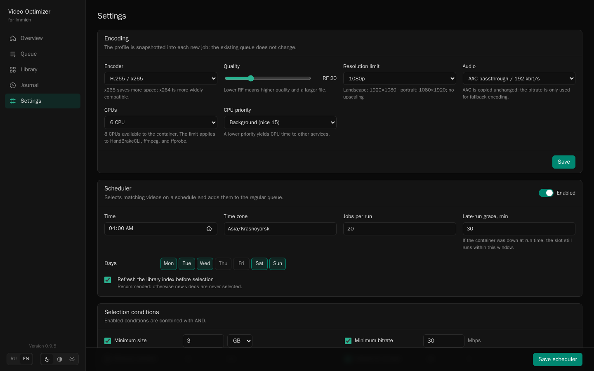

# Immich Video Optimizer

[Русская версия](README.md)

Phone videos are usually what eats most of the space in an
[Immich](https://immich.app/) library. One minute of 4K at 60 fps can easily
take 300–700 MB, and for a family archive that bitrate is almost always overkill.

**Immich Video Optimizer** is a separate container that runs next to Immich. It
finds large videos in the storage, re-encodes them with HandBrake to H.265 or
H.264, checks the result thoroughly, and only then — when you say so — swaps it
in for the original. The old file is kept as a backup and can be restored with
one click.

On the author's home server, the first five phone clips went from 5.7 GB down to
1.4 GB (−75%) with no visible difference when watching them.

[](docs/screenshots/en/overview.png)

| Queue | Library | Journal | Job card | Settings |
|:---:|:---:|:---:|:---:|:---:|
| [](docs/screenshots/en/queue.png) | [](docs/screenshots/en/library.png) | [](docs/screenshots/en/journal.png) | [](docs/screenshots/en/job.png) | [](docs/screenshots/en/settings.png) |

> [!WARNING]
> The optimizer modifies files in the Immich storage directly. The web UI has no
> login, so only expose it to a trusted network. Start with
> `REPLACEMENT_ENABLED=false` and run the whole cycle on a couple of videos first.

## What it does

- **Finds candidates.** Scans `library` and `upload` and shows size, codec,
  resolution, frame rate and bitrate for every video, with filters and sorting.
- **Encodes one at a time.** A single background worker; the queue survives
  container restarts and you can close the page. CPU count and priority can be
  limited so Immich and other services stay responsive.
- **Validates the result.** Duration, resolution and orientation, frame rate,
  audio, metadata (date, GPS, phone model), a full FFmpeg decode and a minimum
  saving. If any check fails, the original is left alone.
- **Lets you compare.** Watch the original and the result side by side, or flip
  between them A/B on the same frame.
- **Replaces safely.** Atomic swap, SHA-1 re-checked right before it, original
  kept as a backup. Restoring it is one click too.
- **Runs on its own if you want.** The scheduler picks videos by your rules and
  queues them. Automatic replacement and automatic deletion of old backups are
  separate switches and are off by default. The overview shows exactly what the
  next run will do.

The UI is available in English and Russian, with light, dark and system themes.

## How it works

1. The optimizer reads video files straight from the Immich storage. It does not
   connect to Immich's database, Redis or API.
2. You add videos to the queue by hand, or the scheduler does it.
3. HandBrake encodes a copy into a work folder; the original stays untouched the
   whole time.
4. The copy goes through the checks. If everything passes, the job becomes
   "Ready to replace".
5. You (or automatic replacement, for scheduler jobs) swap the file. The original
   moves to the backup folder.
6. The backup can be deleted by hand, deleted automatically after N days, or
   restored.

Immich keeps seeing the same file at the same path — it is just smaller now. The
checksum in Immich's database deliberately stays the same, so the mobile app
still treats the original as uploaded and does not upload it again. Details are
in the [safety model](docs/safety.en.md).

## Quick start

You need Linux `amd64`, Docker Compose and access to the folder Immich uses as
`UPLOAD_LOCATION`.

1. Download [`compose.example.yml`](compose.example.yml) and save it as
   `compose.yml`.
2. Set two paths, in a `.env` file next to it or in the environment:

   ```bash
   # Folder that contains Immich's UPLOAD_LOCATION
   # (here UPLOAD_LOCATION=/srv/immich/data)
   IMMICH_STORAGE=/srv/immich
   # Where the optimizer keeps its database and settings
   OPTIMIZER_STATE=/srv/immich-video-optimizer
   ```

3. Start it:

   ```bash
   docker compose up -d
   ```

4. Open `http://127.0.0.1:8090` and click "Scan library".

Inside the container everything must be on one filesystem, otherwise an atomic
swap is impossible:

```text
/storage/                ← IMMICH_STORAGE
├── data/                ← Immich UPLOAD_LOCATION
│   ├── library/
│   └── upload/
└── optimizer-work/      ← encoded files and backups
```

If your `UPLOAD_LOCATION` has a different name, for example `/srv/immich/photos`,
set `MEDIA_ROOTS` to `/storage/photos/library:/storage/photos/upload`. Keep the
work folder next to `UPLOAD_LOCATION`, not inside it.

## First run: making sure it works

1. Keep `REPLACEMENT_ENABLED=false`. In this mode the optimizer only encodes and
   validates; it never replaces anything.
2. In "Library", pick two or three videos and add them to the queue.
3. When the jobs are "Ready to replace", open the job card: look at the checks
   and compare the original with the result.
4. If you are happy with it, set `REPLACEMENT_ENABLED=true`, recreate the
   container and replace one video.
5. Check that Immich shows and plays it as before. Then try "Restore original" —
   the file should come back byte for byte.

After that you can process the rest and, if you like, turn on the scheduler.

## Configuration

Encoding, resources and the schedule are set in the UI under "Settings".
Environment variables only cover the deployment:

| Variable | Default | Purpose |
|---|---|---|
| `MEDIA_ROOTS` | `/storage/data/library:/storage/data/upload` | Video folders, separated by `:` |
| `WORK_ROOT` | `/storage/optimizer-work` | Encoded files and backups |
| `OPTIMIZER_DB` | `/state/optimizer.sqlite3` | The optimizer's database |
| `REPLACEMENT_ENABLED` | `false` | Allow replacing files in the library |
| `MINIMUM_SAVING_PERCENT` | `20` | Minimum saving required before replacement is allowed |
| `TZ` | `UTC` | Container time zone and the scheduler's default |
| `PORT` | `8090` | HTTP port inside the container |

Default profile: x265, RF 20, limited to 1080p (portrait videos to 1080×1920),
AAC copied without re-encoding. HDR and 10-bit videos are encoded to 10-bit x265,
and the frame rate is capped at 60 fps.

## Limitations

- Linux `amd64` only; replacement needs `renameat2(RENAME_EXCHANGE)`.
- No users, roles or TLS. It is a single-admin tool for a trusted network; put
  an authenticating proxy in front of it if you need remote access.
- Only MP4, MOV, M4V and 3GP are processed, because the result keeps the original
  file name. Videos with subtitles, data tracks or several audio tracks are
  skipped so nothing gets lost — iPhone MOV files often fall into this group.
- The optimizer relies on Immich's current storage layout. After a major Immich
  upgrade, try it on a couple of videos first.

## Building and tests

```bash
python3 -m unittest discover -s tests -v

docker build -f Dockerfile.release \
  --build-arg VERSION=0.9.5 \
  -t immich-video-optimizer:0.9.5 .
```

Prebuilt images are on GitHub Container Registry:
`ghcr.io/rustrey/immich-video-optimizer`, tagged with the version (`0.9.5`), the
minor line (`0.9`) and `latest`. Pin the exact version on a server. The release image builds
HandBrake 1.11.2 from the official sources with a SHA-256 check and is published
with an SBOM and provenance.

## License

The code is under the [MIT License](LICENSE). HandBrake, FFmpeg and other
components in the image come with their own licenses; see
[THIRD_PARTY_NOTICES.md](THIRD_PARTY_NOTICES.md).
