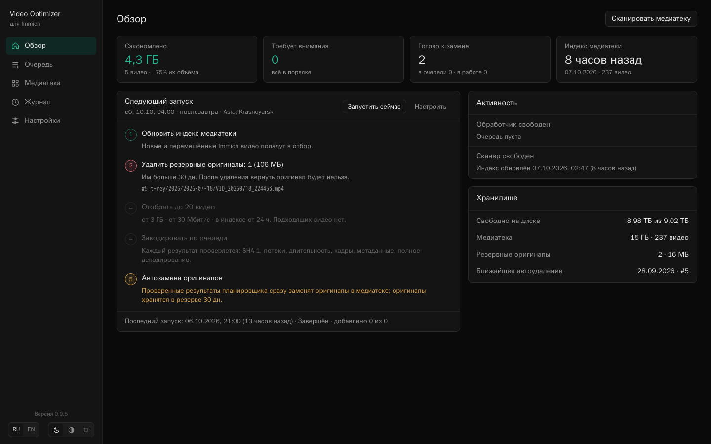
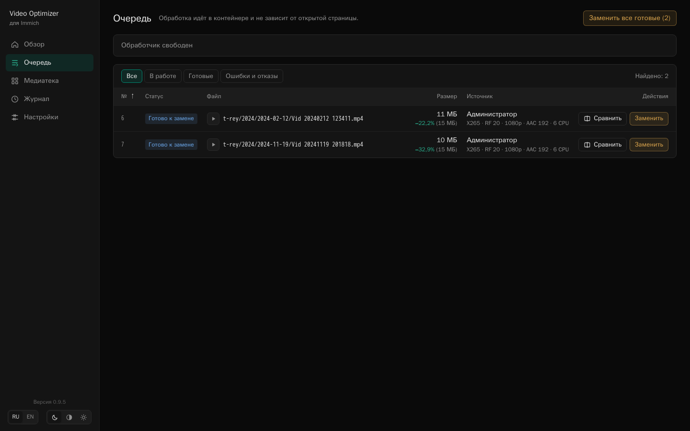
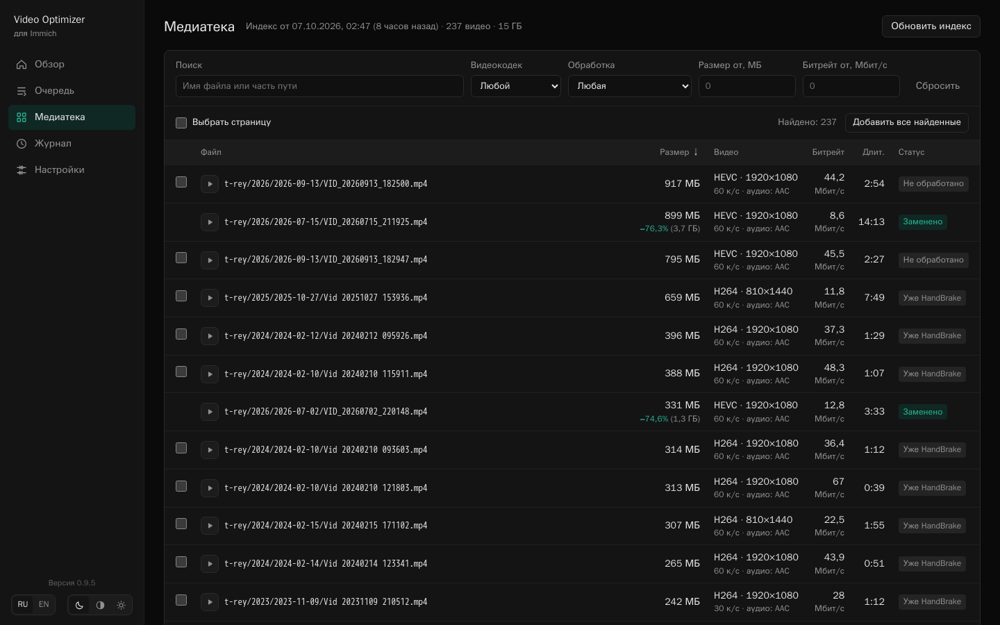
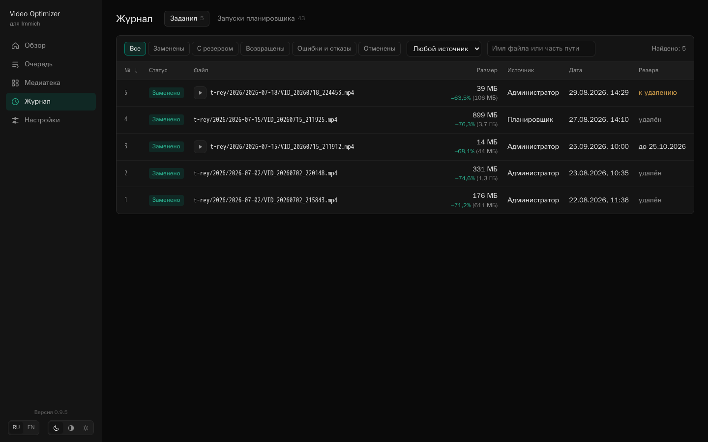
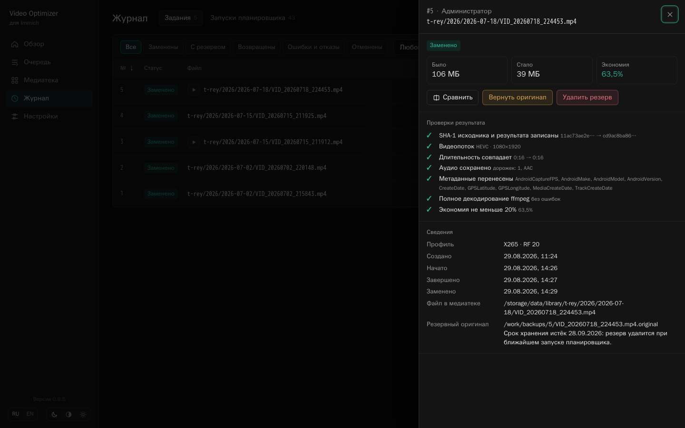
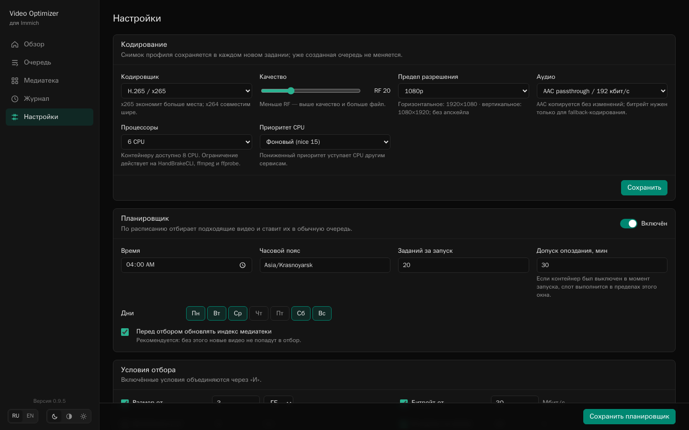

# Immich Video Optimizer

[English version](README.en.md)

Видео с телефона занимают больше всего места в [Immich](https://immich.app/).
Минута 4K 60 fps — это легко 300–700 МБ. Для семейного архива такой битрейт
почти всегда избыточен.

**Immich Video Optimizer** — отдельный контейнер рядом с Immich. Он находит
крупные видео в хранилище, пережимает их через HandBrake в H.265 или H.264,
тщательно проверяет результат и только потом, по вашему решению, подменяет
оригинал. Старый файл остаётся в резерве, и его можно вернуть одной кнопкой.

На домашней инсталляции автора первые пять роликов с телефона похудели с 5,7 ГБ
до 1,4 ГБ (−75%), без заметной разницы при просмотре.

[](docs/screenshots/ru/overview.png)

| Очередь | Медиатека | Журнал | Карточка задания | Настройки |
|:---:|:---:|:---:|:---:|:---:|
| [](docs/screenshots/ru/queue.png) | [](docs/screenshots/ru/library.png) | [](docs/screenshots/ru/journal.png) | [](docs/screenshots/ru/job.png) | [](docs/screenshots/ru/settings.png) |

> [!WARNING]
> Оптимизатор меняет файлы в хранилище Immich напрямую. У веб-интерфейса нет
> входа по паролю — открывайте его только в доверенной сети. Начните с
> `REPLACEMENT_ENABLED=false` и прогоните весь цикл на паре видео.

## Что умеет

- **Находит кандидатов.** Сканирует `library` и `upload`, показывает размер,
  кодек, разрешение, частоту кадров и битрейт каждого видео. Фильтры и
  сортировка — как в обычном файловом менеджере.
- **Пережимает по очереди.** Один фоновый обработчик, очередь переживает
  перезапуск контейнера, страницу можно закрыть. Можно ограничить число ядер и
  приоритет, чтобы Immich и другие сервисы не тормозили.
- **Проверяет результат.** Длительность, разрешение и ориентация, частота
  кадров, аудио, метаданные (дата, GPS, модель телефона), полное декодирование
  FFmpeg и минимальная экономия. Не прошло хоть одно — оригинал не трогается.
- **Даёт сравнить.** Оригинал и результат можно посмотреть рядом или
  переключать A/B на одном кадре.
- **Заменяет безопасно.** Атомарно, с повторной сверкой SHA-1 перед заменой и с
  резервом оригинала. Возврат — тоже одной кнопкой.
- **Работает сам, если попросить.** Планировщик по расписанию отбирает видео
  по условиям и ставит их в очередь. Автозамена и автоудаление старых резервов
  включаются отдельно и по умолчанию выключены. На «Обзоре» видно, что именно
  произойдёт при следующем запуске.

Интерфейс на русском и английском, со светлой, тёмной и системной темой.

## Как это устроено

1. Оптимизатор читает файлы видео прямо из хранилища Immich. К базе данных,
   Redis и API Immich он не подключается.
2. Вы добавляете видео в очередь вручную или это делает планировщик.
3. HandBrake кодирует копию в рабочий каталог; оригинал всё это время лежит
   нетронутым.
4. Результат проходит проверки. Если всё хорошо, задание получает статус
   «Готово к замене».
5. Вы (или автозамена для заданий планировщика) подменяете файл. Оригинал
   уходит в каталог резервов.
6. Резерв можно удалить вручную, автоматически через N дней или вернуть обратно.

Immich продолжает видеть тот же файл по тому же пути, просто он стал меньше.
Checksum в базе Immich намеренно остаётся прежней: благодаря этому мобильное
приложение считает оригинал уже загруженным и не отправляет его повторно.
Подробно — в [модели безопасности](docs/safety.md).

## Быстрый старт

Нужны Linux `amd64`, Docker Compose и доступ к каталогу, который в Immich задан
как `UPLOAD_LOCATION`.

1. Скачайте [`compose.example.yml`](compose.example.yml) и сохраните как
   `compose.yml`.
2. Укажите два пути — в `.env` рядом или в окружении:

   ```bash
   # Каталог, внутри которого лежит UPLOAD_LOCATION Immich
   # (здесь UPLOAD_LOCATION=/srv/immich/data)
   IMMICH_STORAGE=/srv/immich
   # Куда оптимизатор сохраняет свою базу и настройки
   OPTIMIZER_STATE=/srv/immich-video-optimizer
   ```

3. Запустите:

   ```bash
   docker compose up -d
   ```

4. Откройте `http://127.0.0.1:8090` и нажмите «Сканировать медиатеку».

Внутри контейнера всё должно лежать на одной файловой системе — иначе атомарная
замена невозможна:

```text
/storage/                ← IMMICH_STORAGE
├── data/                ← UPLOAD_LOCATION Immich
│   ├── library/
│   └── upload/
└── optimizer-work/      ← результаты кодирования и резервы
```

Если `UPLOAD_LOCATION` называется иначе, например `/srv/immich/photos`,
поменяйте `MEDIA_ROOTS` на `/storage/photos/library:/storage/photos/upload`.
Рабочий каталог держите рядом с `UPLOAD_LOCATION`, а не внутри него.

## Первый запуск: как убедиться, что всё в порядке

1. Оставьте `REPLACEMENT_ENABLED=false`. В этом режиме оптимизатор только
   кодирует и проверяет, но ничего не заменяет.
2. В «Медиатеке» выберите два-три видео и добавьте их в очередь.
3. Когда задания станут «Готово к замене», откройте карточку задания:
   посмотрите проверки, сравните оригинал и результат.
4. Если результат устраивает, включите `REPLACEMENT_ENABLED=true`, пересоздайте
   контейнер и замените одно видео.
5. Убедитесь, что Immich показывает и проигрывает его как раньше. Затем
   попробуйте «Вернуть оригинал» — файл должен вернуться байт в байт.

После этого можно спокойно обрабатывать остальное и при желании включить
планировщик.

## Настройка

Кодирование, ресурсы и расписание меняются в «Настройках» интерфейса. Через
переменные окружения задаётся только то, что относится к развёртыванию:

| Переменная | По умолчанию | Назначение |
|---|---|---|
| `MEDIA_ROOTS` | `/storage/data/library:/storage/data/upload` | Каталоги с видео, через `:` |
| `WORK_ROOT` | `/storage/optimizer-work` | Результаты кодирования и резервы |
| `OPTIMIZER_DB` | `/state/optimizer.sqlite3` | База оптимизатора |
| `REPLACEMENT_ENABLED` | `false` | Разрешить заменять файлы в медиатеке |
| `MINIMUM_SAVING_PERCENT` | `20` | Минимальная экономия, при которой замена разрешена |
| `TZ` | `UTC` | Часовой пояс контейнера и планировщика по умолчанию |
| `PORT` | `8090` | HTTP-порт внутри контейнера |

Профиль по умолчанию: x265, RF 20, предел 1080p (вертикальные видео — 1080×1920),
AAC копируется без перекодирования. HDR и 10-битные видео кодируются в 10-битный
x265, частота кадров ограничивается 60 к/с.

## Ограничения

- Только Linux `amd64`; для замены нужен `renameat2(RENAME_EXCHANGE)`.
- Нет пользователей, ролей и TLS. Это инструмент одного администратора в
  доверенной сети; если нужен доступ снаружи — ставьте перед ним прокси с
  авторизацией.
- Обрабатываются только MP4, MOV, M4V и 3GP: результат сохраняется под прежним
  именем. Видео с субтитрами, data-дорожками или несколькими аудиодорожками
  пропускаются, чтобы ничего не потерять, — сюда часто попадают MOV с iPhone.
- Оптимизатор полагается на текущую структуру хранилища Immich. После крупных
  обновлений Immich сначала проверьте его на паре видео.

## Сборка и тесты

```bash
python3 -m unittest discover -s tests -v

docker build -f Dockerfile.release \
  --build-arg VERSION=0.9.5 \
  -t immich-video-optimizer:0.9.5 .
```

Готовые образы — в GitHub Container Registry:
`ghcr.io/rustrey/immich-video-optimizer` с тегами версии (`0.9.5`), минорной
ветки (`0.9`) и `latest`. Для сервера лучше закрепить точную версию. Release-образ собирает
HandBrake 1.11.2 из официальных исходников с проверкой SHA-256 и публикуется с
SBOM и provenance.

## Лицензия

Код — под [MIT License](LICENSE). HandBrake, FFmpeg и другие компоненты образа
распространяются под своими лицензиями, см.
[THIRD_PARTY_NOTICES.md](THIRD_PARTY_NOTICES.md).
